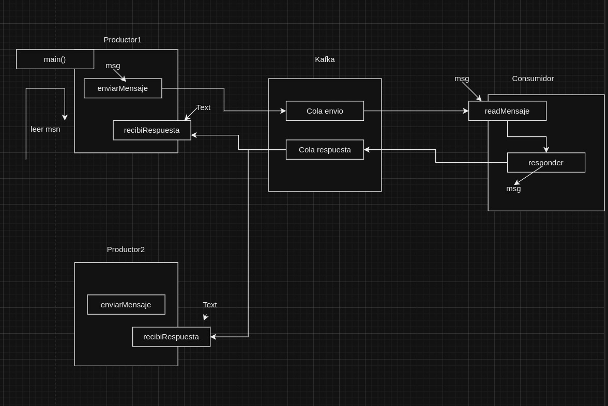

# INSTALL DEPENDENCIAS
## go mod init main
## go mod tidy

# go build mainProductor.go
# go build mainConsumidor.go
# ./mainProductor 
# ./mainConsumidor

# Ajustar los nombres a cliente servidor(No producto consumidor)
## sugerencias, para lo que hacemos no hace falta un coordinador, ya con kafka y una cola se puede hacer

